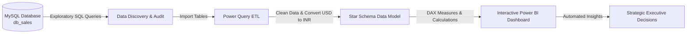
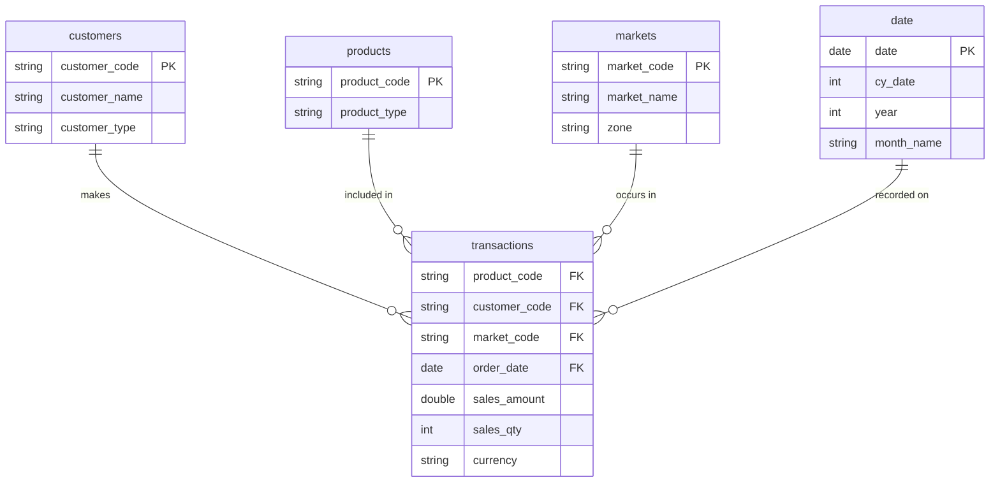

# 📊 AtliQ Hardware: Sales Insights & Performance Analytics

[](https://powerbi.microsoft.com/)
[](https://www.mysql.com/)
[](https://en.wikipedia.org/wiki/SQL)
[](https://opensource.org/licenses/MIT)

> **End-to-End Business Intelligence & Data Analytics Solution**  
> *A real-world case study analyzing sales performance, customer trends, and market metrics for AtliQ Hardware.*

---

## 📌 Executive Summary

**AtliQ Hardware** is a computer hardware and peripherals supplier serving clients across multiple regions in India. As the business expanded, executive management faced critical challenges in tracking sales trends, identifying low-performing regions, and obtaining reliable real-time reporting.

This project delivers a complete **Data Analytics & Business Intelligence pipeline**:
- **Database Engine:** MySQL for relational data storage and structured SQL queries.
- **ETL & Data Cleaning:** Power Query for data transformation and currency normalization.
- **Data Modeling:** Star Schema design for fast performance and intuitive reporting.
- **Interactive Reporting:** Power BI Desktop dashboard with dynamic KPIs and DAX measures.

---

## 🎯 Business Problem & Requirements (AIMS Grid)

The **AIMS Grid** framework was established to align technical tasks with core business goals:

```
+---------------------------------------------------------------------------------------+
|                                    AIMS GRID                                          |
+---------------------------------------------------------------------------------------+
| 1. Purpose:                                                                           |
|    Unlock hidden sales insights, monitor regional revenue trends, and pinpoint        |
|    underperforming markets to enable data-driven executive decision-making.           |
|                                                                                       |
| 2. Stakeholders:                                                                      |
|    - Sales Director (Bhavin Patel)                                                    |
|    - Marketing & Regional Sales Managers                                              |
|    - Data Analytics Team                                                              |
|                                                                                       |
| 3. End Result:                                                                        |
|    An interactive, auto-refreshing Power BI dashboard featuring dynamic filters,       |
|    KPI cards, regional heatmaps, and customer segmentation.                           |
|                                                                                       |
| 4. Success Criteria:                                                                  |
|    - Replace slow, error-prone manual Excel reporting.                                |
|    - Enable real-time filtering across regions, customers, and time periods.          |
|    - Identify top 5 customers and market zones driving 80%+ of overall revenue.       |
+---------------------------------------------------------------------------------------+
```

---

## 🏗️ Project Architecture



---

## 🗄️ Database Schema & Data Modeling

Raw tables from the MySQL database (`db_sales`) were transformed into an optimized **Star Schema**:



### Table Definitions
* 📊 **`transactions` (Fact Table):** Contains transactional details including `sales_amount`, `sales_qty`, `currency`, and foreign keys.
* 👤 **`customers` (Dimension):** Stores customer identity and channel type (*Brick & Mortar* vs. *E-Commerce*).
* 🏬 **`markets` (Dimension):** Contains geographic regions (*Delhi NCR, Mumbai, Ahmedabad, Chennai, etc.*) and zones (*North, South, Central*).
* 📦 **`products` (Dimension):** Stores product IDs and product categories.
* 📅 **`date` (Dimension):** Calendar mapping with year, month name, and fiscal periods.

---

## 🔍 Data Discovery & SQL Queries

Exploratory queries executed in **MySQL Workbench** to audit raw data:

```sql
-- 1. Inspect total customer base
SELECT COUNT(*) AS total_customers FROM customers;

-- 2. Retrieve transactions for specific market (Chennai / Mark001)
SELECT * FROM transactions WHERE market_code = 'Mark001';

-- 3. Identify transactions in USD currency
SELECT * FROM transactions WHERE currency = 'USD' OR currency = 'USD\r';

-- 4. Calculate total revenue for 2020 (filtered for valid currency entries)
SELECT SUM(t.sales_amount) AS total_revenue_2020
FROM transactions t
INNER JOIN date d ON t.order_date = d.date
WHERE d.year = 2020 
  AND (t.currency = 'INR\r' OR t.currency = 'USD\r');

-- 5. Revenue by market zone in 2020 (Chennai / Mark001)
SELECT SUM(t.sales_amount) AS chennai_revenue_2020
FROM transactions t
INNER JOIN date d ON t.order_date = d.date
WHERE d.year = 2020 AND t.market_code = 'Mark001';
```

---

## 🧹 ETL & Data Transformation (Power Query)

1. **Filtering Out Invalid Records:** Removed transaction entries where `sales_amount <= 0` or `sales_amount = -1`.
2. **Currency Standardization:** Converted transactions in `USD` to `INR` using a custom column formula:
   ```dax
   norm_sales_amount = IF(sales_transactions[currency] == "USD" || sales_transactions[currency] == "USD#(cr)", sales_transactions[sales_amount] * 75, sales_transactions[sales_amount])
   ```
3. **Data Cleaning:** Stripped unprintable control characters (`\r`) and standardized market zone groupings.

---

## 📐 Key DAX Measures

Essential DAX expressions created for financial and operational metrics:

```dax
-- Total Revenue
Total Revenue = SUM(sales_transactions[norm_sales_amount])

-- Total Quantity Sold
Total Quantity = SUM(sales_transactions[sales_qty])

-- Year-over-Year (YoY) Revenue Growth %
Revenue YoY % = 
VAR PrevYearRevenue = CALCULATE([Total Revenue], SAMEPERIODLASTYEAR(sales_date[date]))
RETURN DIVIDE([Total Revenue] - PrevYearRevenue, PrevYearRevenue, 0)

-- Revenue Share Contribution %
Revenue Contribution % = 
DIVIDE([Total Revenue], CALCULATE([Total Revenue], ALL(sales_customers)), 0)
```

---

## 💡 Key Business Insights

* 🏆 **Dominant Market:** **Delhi NCR** is the largest revenue generator, contributing over 50% of total company sales.
* 🏪 **Top Customer:** **Electricalsara Stores** leads customer revenue contribution across all regions.
* 📈 **Channel Growth:** While **Brick & Mortar** holds higher baseline volume, **E-Commerce** exhibits faster year-over-year revenue growth.
* 🎯 **Strategic Focus Area:** Southern territories (*Bengaluru, Chennai*) demonstrate untapped market potential, recommending refreshed sales strategies.

---

## 🚀 How to Run / Replicate This Project

### Prerequisites
* [MySQL Server](https://dev.mysql.com/downloads/mysql/) & MySQL Workbench (v8.0+)
* [Power BI Desktop](https://powerbi.microsoft.com/desktop/) (Free)

### Setup Instructions

1. **Clone the Repository:**
   ```bash
   git clone https://github.com/Chilakala-Surya-Prakash/Sales_Analysis.git
   cd Sales_Analysis
   ```

2. **Restore Database in MySQL:**
   * Open MySQL Workbench.
   * Run the [`db_dump.sql`](db_dump.sql) script to create and populate the `db_sales` database.

3. **Open Power BI Dashboard:**
   * Open [`Sales_Analysis.pbix`](Sales_Analysis.pbix) in Power BI Desktop.
   * Update database connections under `Transform Data` -> `Data Source Settings` (`Server: localhost` | `Database: db_sales`).
   * Click **Apply Changes** to refresh visuals.

---

## 📂 Repository File Structure

```
Sales_Analysis/
├── Sales_Analysis.pbix     # Interactive Power BI Report File
├── db_dump.sql             # MySQL Database Dump File
└── README.md                   # Detailed Project Documentation
```

---

## 📜 License

This project is licensed under the [MIT License](LICENSE) - free to use for personal and learning purposes.
